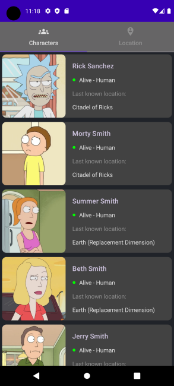

# Rick-and-Morty-App
This app uses Rick and Morty API to display of information about the characters from the television show "Rick and Morty."

## Built With
1. Kotlin
2. MVVM - Single Activity Architecture
3. Jetpack Compose
4. Coroutines
5. Flow - StateFlow
6. Hilt
7. Retrofit 2
8. Moshi

## Preview
  
